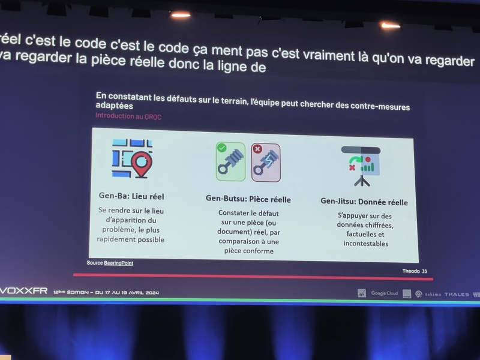
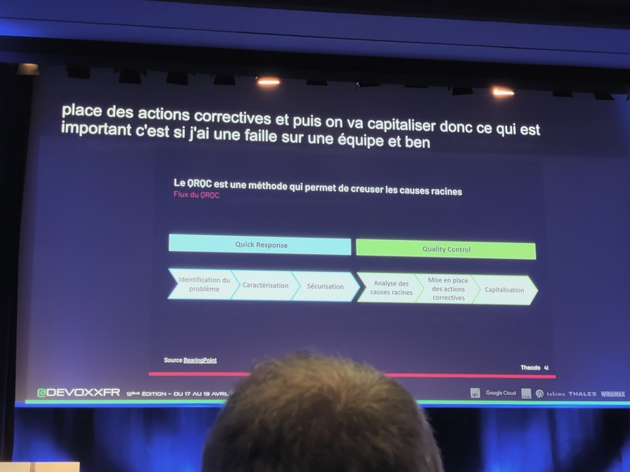
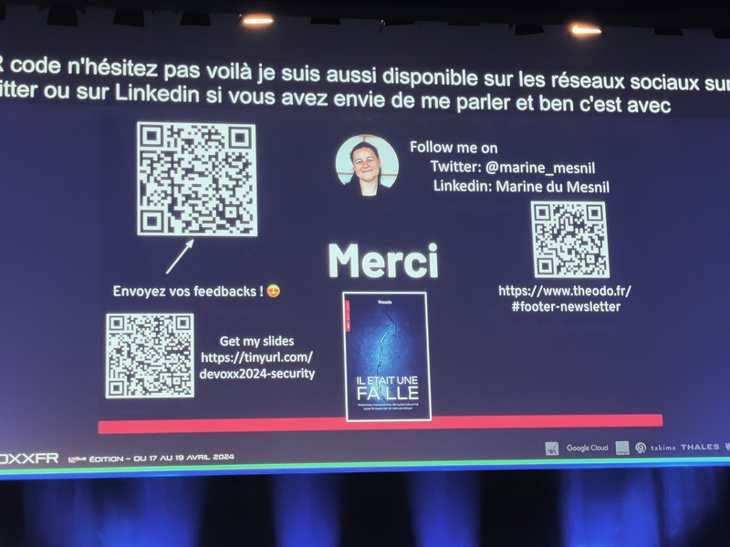
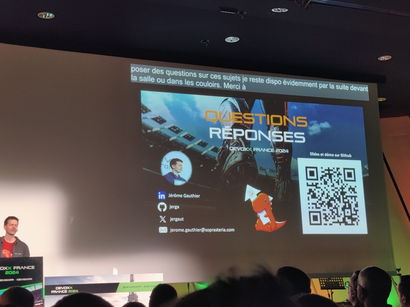
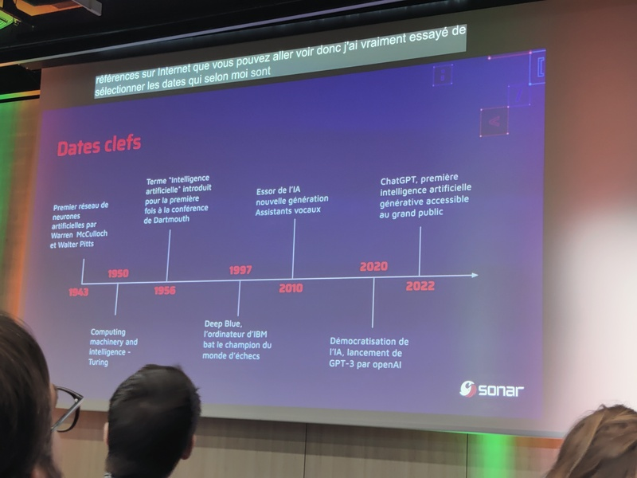
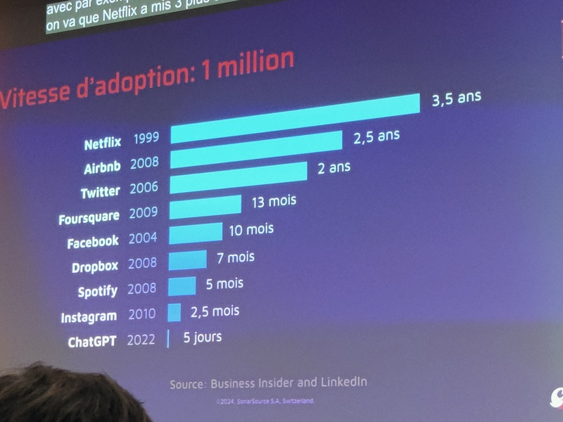
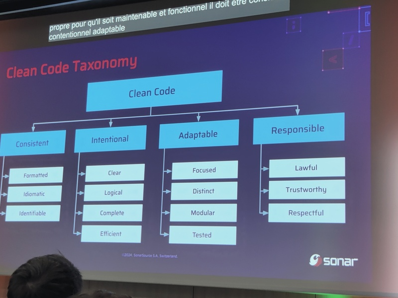
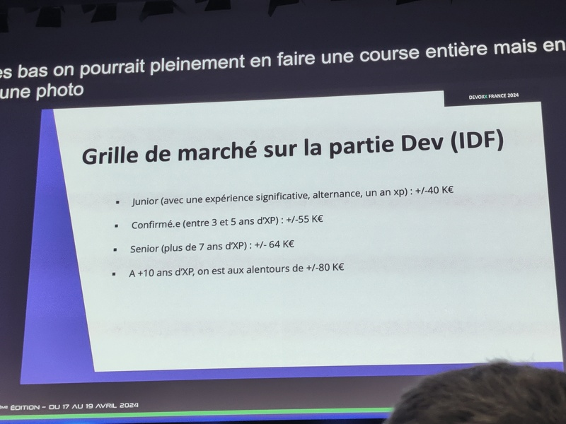
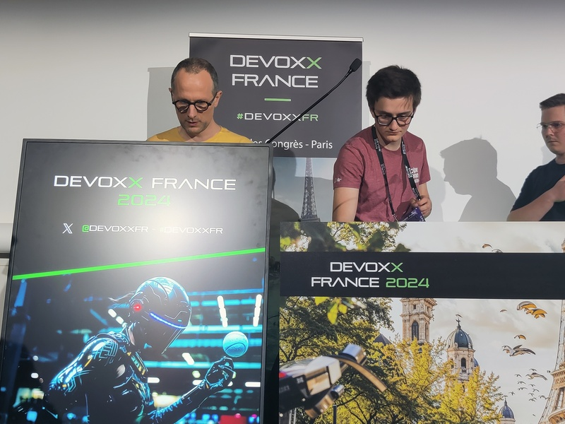

# 9:00 9:25 - Programming’s Greatest Mistakes
Mark Rendle, développeur et stand-up

Marc commence par l'histoire d'un correcteur de fichiers qu'on lui a demandé de
développer et qu'il a appelé `unf*cked`. Et des fichiers avec cette extension sont arrivés chez le client …

Il parle ensuite des bugs qui ont couté beaucoup d'argent

- Y2K: le bug de l'an 2000 car on a representé les dates sur 2 caractères
- Y2K22
- Y2k38 (the epochalypse)
- The Kennel Club - Bug insolite avec "DOG 38" car seulement 6 caractères sont prévus pour stocker le nombre en chiffres romains (XXXVIII).
- Mariner 1 car une variable n'a pas été smoothé
- Mars climate car une métrique en pound-force-second (convention US) est interpreté comme des newton-second (standard international)
- Ariane 5 en raison d'un copier/coller du code d'Ariane 4 et du stockage d'un nombre en 64 bits dans un registre 16 bits.

**Conclusion: Don't trust computers**

# 9:35 10:00 - Un monde shooté aux métaux
Guillaume Pitron, Psyché-16 / Agnes Crepet, Fairphone / Ninja Squad

50, 60, 70 métaux sont présents dans nos smartphones.

Par ex., l'indium est utilisé pour rendre l'écran tactile.

Le recyclage est impossible pour les métaux intriqués.

Les mines sont géographiquement loin. Par ex. en RDC pour 70% du cobalt.

2 types de mines d'extraction des métaux

- industriel : finance les conflits armés
- artisanal : étude d'amnesty international sur le travail des enfants

Loi pour l'allongement de la durée de vie (obligation de fournir des mises à jour pendant 5 ans)

L'exploitation des mines posent aussi des problèmes ESG (environnementaux, sociaux, gouvernance)

Fairphone a travaillé sur la Fair Cobalt Alliance en RDC.

# 11:35 12:20 - Automatiser ses contrôles de sécurité : Arrêtez de cacher vos failles à côté des monstres sous votre lit !
[Marine du Mesnil](https://twitter.com/marine_mesnil): Head of Cybersecurity Tribe à Theodo

A l'approche des JO, la France devrait passer en 1ère place du nombre d'attaque.

50 nouvelles CVEs par jour.

> Where everyone is responsible, no one is really responsible

Il faut automatiser pour être serein.

Outils: semgrep.

juice-shop est un projet de l'owasp volontairement vulnérable.

sonarqube -> management visuel

QRQC (Quick Response Quality Control) vient du Lean de Toyota.

Le talk déroule un exemple de faille "controle d'accès" du à l'absence de `@PreAuthorize`

Actions

- ajout d'un test pour vérifier 403 sur la route incriminée
- dev d'un outil qui vérifie que toutes les routes ont une directive `@PreAuthorize`, quitte à utiliser `@PreAuthorize("permitAll")` pour les routes publiques.

outils: 

- gratuit: renovate, dependabot pour vérifier les vulnérabilités
- payant: snyk

Le repo [theodo-group/awesome-security-automation](https://github.com/theodo-group/awesome-security-automation) contient des liens pour automatiser ses contrôles de sécurité.

Conclusion: après un incident, il faut se poser 2 questions

- pourquoi ça a été introduit (ex: manque de formation des devs ?)
- pourquoi ça n'a pas été catché (ex: manque sur la CI ?)

# 12:35 12:50 - Je délègue tous mes tests à une IA

# 13:00 13:15 - C4 model, la solution pour standardiser mes schémas d'architecture ?
Jérôme Gauthier, Sopra Steria

Existant: UML, Archimate, BPMN

Simon Brown créé le C4 model et définit 4 niveaux d'abstraction

- Context
- Container: webapp, batch, BDD
- Component
- Code

Indépendant d'un outil ou d'une notation

Diagram as code avec [Structurizr](https://structurizr.com/) qui définit un DSL.

# 13:30 14:15 - Porter le Flambeau du Clean Code à l’ère du GenAI
Gabriel Vivas, Sonar / Nolwenn Cadic, Sonar

## Histoire de l'IA

## Histoire du clean code

Le livre Clean Code date de 2008 mais clean code date d'avant.

En 1999, xp explained et refactoring

Mais en fait, existe depuis les années 1970

- Disjkstra 1968 : Goto considered harmful
- Parnos 1971 : decompose into modules
- 1974 : structured design
- 1974 : The lements of programing style (avec des ex de code conforme / code non conforme)

Blog post : [What is Clean Code?](https://www.sonarsource.com/blog/what-is-clean-code/)

Expérience: Le but de l'expérience est de développer une méthode pour chiffrer/déchiffrer. On peut utiliser des livres, internet mais un groupe peut utiliser un LLM et pas l'autre. Le groupe LLM a produit un code moins sécurisé, tout en ayant une meilleure confiance dans le code produit.

**Conclusion: ne pas faire confiance aveuglément aux machines**

# 14:35 15:20 - Rendez vos applications Kafka plus robustes
Stéphane Derosiaux, cofondateur et CTO de Conduktor

## Liste d'anti-patterns

- avoir trop de partitions (genre 200)
- mettre `min.insync.replica` à 1 (généralement 2)
- mettre le RF autant que de brokers (laisser le RF à 3).
- utiliser des gros messages. (Kafka n'est pas fait pour des PDF de 20 Mo).
- mettre une rétention infinie (à moins que KIP-405 avec tiered-storage qui permet d'offloader sur S3)
- pas de monitoring (utiliser grafana, datadog, …)
- pas d'alerting
- utiliser les params par défaut, c'est à dire pas de `linger.ms`, pas de compression, pas de `batch.size`
- ne pas utiliser la callback retournée par producer.send(record)
- overcommit (et surtout pas à chaque message)
- utiliser `acks=0` pour aller plus vite.
- utiliser `min.fetch.bytes=0` => ça tue les brokers.
- Kafka transaction. Regarder SAGA pattern pour transactions distribuées

## Stratégies pour gérer les *poison pills* (message invalide)

- Log & Skip
- Intervention manuelle
- DLQ (Dead Letter Queue)
à utiliser seulement pour le non retryable
Garder les infos de partition/offset/timestamp dans DLQ

## Schema registry

créer un topic-v2 pour gérer les breaking changes

## Kafka proxy

C'est pénible à implémenter. 74 verbes dans le protocole donc 148 messages (requête et réponse) à gérer.

Ca permet de faire plein de choses: caching, chaos testing, …

# 15:40 16:25 - Debugguez votre salaire ! Mes stratégies gagnantes pour réussir sa négociation salariale
Shirley ALMOSNI CHICHE, BUILD RH :  Recruteuse IT depuis plus de 10 ans et agent de carrière depuis 3 ans. 

Premier cadeau, une grille de marché

Les principaux arguments avancés lors de la négo

- la grille salariale
- la distorsion entre les employés
- finance compliquée
- le niveau technique insuffisant
- le plaisir de négocier
- la discrimination: reconversion, handicap, …

Rappel que la situation est tendue après 200K licenciements dans la tech.

Sur l'état du marché : [Salaires de la tech 2023-2024](https://blog.zwindler.fr/2024/01/05/salaires-dans-la-tech-quelques-ressources-externes-2023-2024/)

Shirley présente ensuite avec beaucoup d'humour les différentes stratégies pour tirer son épingle du jeu.

Quelques conseils : 

- technique du miroir empathique
- ne pas négliger l'entretien RH, c'est l'opportunité de glaner des infos
- rencontrer l'équipe (si l'équipe est claquée au sol …)
- avoir plusieurs pistes
- ne pas réfléchir plus de 48h après une propale.

# 17:00 17:30 - Instrumentez vos applications Java avec OpenTelemetry !
[Bruce Bujon](https://twitter.com/HardCoding), Datadog

OpenTelemetry est un framework d'accessibilité qui collecte pour ensuite exporter ailleurs.

Il est construit sur 3 pilliers : les traces, les logs, les metrics (req/s, cpu, …)

Bruce dit que quand il ne connait pas, **il commence par lire la doc** (puisse son message être entendu par le plus grand nombre) !

Il va se focus sur la partie trace, en exportant dans la vue APM de datadog.

Il montre 3 façons de faire

1. en utilisant le SDK à la main

2. en utilisant le support des frameworks (spring boot, quarkus, micronaut, …) avec autoconfigure

Il faut utiliser les getter/setter pour propager le contexte afin d'avoir la correlation des traces.

3. en utilisant un java agent (qui patch dynamiquement le bytecode)

# 17:50 18:20 - CyberPeace Miners : introduction à la cybersécurité avec Minecraft
Siegfried Ehret, CyberPeace Institute / Noah Bressoud : étudiant à l'hepia à Genève.

Cyberpeace Institure est une ONG qui aide les ONGs dans le domaine de la cybersécurité.

Le projet consiste en une carte Minecraft comportant 6 niveaux qui permettent de s'initier à la cybersécurité.

Pendant la phase de dev, les serveurs étaient hebergés sur kubernetes, des vrais morceaux de YAML ont même été projetés.

protip: `alias kuku="kubectl"` car `k` est déjà pris pour kakoune

Utilisation de Astro pour le site [miners.cyberpeaceinstitute.org](https://miners.cyberpeaceinstitute.org/) et Vercel pour l'héberger.
