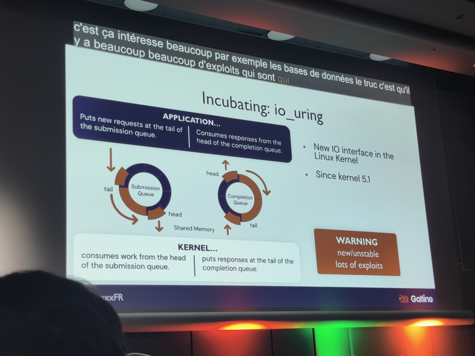

# 09:00 09:25 - Comment modéliser l’état du monde en 2100 ? Le Rapport Meadows
[Anatole Chouard](https://www.youtube.com/@ChezAnatole), 27 ans et vulgarisateur scientifique !

Le rapport Meadows s'interroge sur l'état du monde en 2100.
Il parait en 1968, avant les chocs pétroliers, dans un monde avec 7% de croissance.

5 systèmes et leurs interactions sont étudiées.

En plus de l'hypothèse principale, 12 scénarios alternatifs sont étudiés.

C'est un modèle et pas une prédiction (c'est la forme des courbes qui est importante)

Un nouveau rapport, Earth4All est publié mais il est beaucoup moins nuancé.

# 09:35 10:00 - Cybersécurité et cyberdéfense : un sujet géopolitique
Guillaume Poupard: Polytechnicien (X92) et docteur en cryptographie, ancien directeur de l'ANSSI

La cyber, c'est du sang et des larmes.

En 2017, 2018, ça devient un modèle économique pour le crime organisé. C'est pas
compliqué, mondiale, localisé dans des zones de non-droit (par ex. la Crimée)

1. Le premier sujet est les start-ups du crime. Attaque des hopitaux (rançonnage) par des purs cyniques mais aussi par hasard.

2. La deuxième activité est l'espionnage, **le vrai plus vieux métier du monde**.
Les espions sont hyper discrets car restent plusieurs mois, plusieurs années.

3. Le troisième sujet est géopolitique et concerne la paralysie des systèmes.
Pour les JOs, les possibilités sont vertigineuses.

En France, un problème donc une loi: les opérateurs d'importance vitale doivent se protéger
contre les attaques cyber. 12 secteurs sont identifiés: énergie, média, …

Quelques anecdotes

- En 2015, TV5 Monde est attaquée et affiche un écran noir. Cette histoire vaudra un coup de chaud à notre speaker via un appel du ministre de l'Interieur après une intervention à la radio. L'attribution est difficile. Dans ce cas, c'est les grands pénibles de l'Est.
- En 2017, WannaCry est un ransomware qui paralyse le système de santé brittanique.
- Plus tard, le ransomware NotPetya ne chiffre pas les données mais les efface. Ca vise l'Ukraine mais ça atteint Saint Gobain qui a vendu il y a 2 ans son usine de bouteille en Ukraine mais opère encore.

Tous les conflits modernes sont accompagnés d'attaques cyber.

**Conclusion: on a tous un rôle à jouer pour construire des systèmes sécurisés.**

# 10:30 11:15 - Keeping Your Java Hot by Solving the JVM Warmup Problem
[Simon Ritter](https://twitter.com/speakjava): Deputy CTO of Azul.

Le JIT fait la même analyse à chaque démarrage.

## Sol1: AOT compilation

50% du gain de perf est dû à *speculative optimization* (ex: inline monomorphic call)

Quand utiliser l'AOT => AWS Lambda

## Sol2: Sauvegarde le profilage
Azure Ready Now

## Sol3: Déporter le JIT compiler

L'activité du JIT est *cpu intensive*, l'idée est de la déplacer sur un serveur.

Cloud Native Compiler

## Sol4: Mixe 2 et 3
Ready Now Orchestrator

## Sol5: basé sur Criu (Co-ordinated Resum In Userspace), un mécanisme de Linux utilisé quand on ferme son laptop par ex.

Co-ordinated restore at Checkpoint (CraC)

## Conclusion

Il n'y a pas de silver bullet

# 11:35 12:20 - Sous le capot d'une application JVM - Java Flight Recorder / Java Mission Control
[Guillaume Darmont](https://twitter.com/gdarmont): Principal Engineer in the Platform team @ Malt.

L'obervabilité = logs, traces distribués, métriques.

Quand ça ne suffit pas => profiling.

JFR est une fonctionnalité native du JDK. 

L'overhead est de 1% avec la conf. par défaut et 3% avec la conf profiliing. 

C'est disponible en JDK 11+ et à partir du JDK 8u262+

Il existe plusieurs méthodes pour démarrer un profiling.

JMC permet d'exploiter les fichiers JFR.

Pour la démo, Guillaume a codé une application [git-hashing](https://gitlab.com/gdarmont/git-hashing) qui calcule le hash Git d'un répertoire.

## Opti 1

On voit beaucoup de context switch. ça pointe vers une méthode `synchronized` qui n'a pas besoin de l'être.

## Opti 2

On voit que la taille des read est de 512 octets.
C'est lié à la constante `BUFFER_SIZE`

## Opti 3

On voit beaucoup d'exceptions.
C'est lié à un pb de perf dans le JDK qui utilise les exceptions pour faire du
controle de flux dans la méthode `isAccessible`.

Guillaume a reporté cette erreur et le fix sera disponible en JDK 23 !

Les recommandations faites sont pertinentes.

Dans le cas d'une application distante, on peut se connecter en ssh puis faire un `jcmd`

L'outil nécessite de la pratique.

## Quand utiliser

## A retenir

## Liens

# 12:35 12:50 - 🚀 Vers l'infini et l'au-delà : exploration des mondes secrets d'Internet
Siegfried Ehret, CyberPeace Institute: développeur

Siegfried nous montre comment acceder à Gopher et Gemini à partir de la ligne de commande.

Ces réseaux sont important pour la diversité.

L'approche textuel est aussi économe.

# 13:30 14:15 - Netty, découvrez LE framework IO pour la JVM
Stéphane Landelle, CTO de Gatling

Gatling est basé sur Netty. Bcp de framework web sont basés sur Netty. Et c'est aussi utilisé par Spark, Cassandra, …

Netty offre de super performance et un super design.

Un peu d'historique sur les I/O en Java

- Linux API socket

- Java Socket API est calqué sur celle de Linux. C'est bloquant.

- Linux sort `epoll()`

- Java NIO API sort en Java 4
- Java NIO2 API sort en Java 7 => masque NIO/epoll

Présentation des concepts de Netty

- `Bootstrap`
- `EventLoop`

- `Channel`
- `Handler` (permet d'utiliser un handler par responsabilité)

Netty 4.1 est toujours compatible Java 6 => pas de completion stage, basé sur Future/Promise.

Trucs et astuces

- Threading: 8 EventLoop pour 1000 Channel => n'appeler pas du code bloquant
- Memory Model: utilise des `ByteBuffer`. Il faut appeler `flip` quand on passe de l'écriture à la lecture (pour que le pointeur se déplace dans l'autre sens).

- `HeapByteBuffer` (copie quand on fait des syscall)
- `DirectByteBuffer`

Netty fournit une classe `io.netty.ByBuf` qui utilise 2 indexes (pour éviter le flip). pooled, utilise le reference counting

`PooledByteBufAllocator` basé sur ThreadLocal (c'est pour cela que netty ne tourne pas sur des threads virtuels)

JNI based NIO replacement avec netty-tcnative

`INetAdress.getByName` a 2 problèmes : c'est bloquant et ça n'honore pas les TTL des records. Netty fournit un `AsyncNameResolver`.

## Le futur de Netty

- Support de QUIC et HTTP/3

- En incubation: utilisation de `io_uring` (basé sur 2 ring buffers) pour remplacer `epoll`

- Le support des virtual thread est peu probable

# 14:35 15:20 - Apache Flink - Data Processing en temps réel
Gaël Renoux: Lead Back-End Engineer chez Datadome

DataDome est une solution de détection de bots.

Les chiffres: 200K rps. 300K règles. 100ms de p99 pour décider. 5 jobs Flink. 50 noeuds Kafka.

## API

Basé sur Source - Operator - Sink.

Différent types d'operateurs

Jamais plusieurs thread dans une ExtractFunction

Operateur Aggregation

KeyedProcessFunction

## Déploiement

- 1..N JobManager mais un seul actif
- et des TaskManager

2 modes : session et application (pour kubernetes)

Slot (autant que de vcpu)

Communication entre taches (backpressure)

Chainage si operateur forward

Stockage de l'état : Memory ou Disk (RocksDB). DataDome n'utilise que memory pour raison de perfs.

Checkpoint pour reprise sur erreur et arrêt/relance (montée de version)

Talk du speaker à FlinkForward sur le Blue/Green pour faire des montées de version sans downtime.

- Flink est bloqué en Scala 2.12.7 (à cause d'une compatibilité binaire cassé en 2.12.8)
- API pique
- Dashboard: peu fiable, surtout en cas de load

## Concurrence

- Spark: latence -, throughput ~
- RisingWave
- KafkaStream: lib, pas une plateforme

# 15:40 16:25 - J'ai terminé les 9 Advents of Code : Leçons Apprises
[Teiva Harsanyi](https://teivah.dev/connect): SRE at Google, 100 Go mistakes author.

J'attendais ce talk, n'ayant terminé que 3 Advent Of Code (et en y passant beaucoup de temps)

Anecdote d'un prof qui a dit au speaker : "Si vous êtes bloqué, c'est que vous êtes nul !"

Leetcode pour préparer les entretiens est vécu comme une contrainte.

AoC c'est des exercices de prog en 2 parties. Ex de 2018J18, c'est un jeu de la
vie. pour la partie 1, on calcule 10 étapes. Pour la partie 2, on calcule 1
milliards d'étape.

55K LOC pour terminer

1. Algo et structure de données
Focus sur les graphes. Différentes propriétés

- Directed ou undirected
- Cyclic ou Acyclic

Algo: BFS, DFS, Topological sort, …

Certains algos nécessitent une contraite sur le graphe. Ex: topological sort a besoin que ce soit un DAG.

Pour implémenter topological sort, représentation du graphe sous forme d'un adjency list et utilisation d'un in-degree counter.

Cet algorithme sert pour 2022J21 (les singes hurleurs). C'est aussi utilisé dans GCC, homebrew, GNU Make, …

2. Big O.

s'intéresse au pire des cas. permet de comprendre comment un algo va scaler

2023J5, brute force

- `O(r*n)` => 95s
- `O(r*n)` => 24s (multithread)
- `O(r*log n)` => <1s en utilisant un binary search

Il faut optimiser l'execution après avoir optimiser l'algo.
o
Big O est aussi utilise pourla space complexity.

- c'est crucial pour de nombreux entretiens
- c'est crucial dans un monde avec une explosion des données
- cà permet d'être un meilleur dev

Exemple de calcul de la somme de 1M de valeurs avec un Array et une LinkedList. 
Même complexité mais la LinkedList est ~ 240% plus lent. 
C'est lié au processeur qui fetche une cache line (cache RAM vers cache processeur) quand le pattern d'accès est prévisible

Créer une solution générique lors de la partie 1 n'est presque jamais efficace.
Et c'est la même chose dans la vraie vie (premature conjecture). YAGNI: c'est
fortement conseillé chez Google.

Refactoring avant de publier sur Google.

Behavior testing != BDD.
axé sur le comportement externe attendu ~ black box testing

[Test Behaviour, Not implementation](https://testing.googleblog.com/2013/08/testing-on-toilet-test-behavior-not.html) accroché dans les toilettes de Google.

Autre exemple pour prendre du recul, pour voir la big picture, et se demander
ce qu'on veut résoudre. Exemple de 2018J23 pour penser outside the box.

En conclusion, le speaker montre un parcours de résilience

Une carrière, c'est un marathon (il faut une progression continue dans le temps).

teivah.dev/devoxx

teivah.dev/connect

# 17:00 17:30 - Réinventer l'exploration des bases de données avec Azimutt
Loïc Knuchel: Azimutt

Azimutt est un outil open-source pour l'exploration des bases de données. Il a été créé par Loic alors qu'il était principal eng chez Doctolib. Il se consacre maintenant à plein temps au développement de l'outil.

Une seule commande est nécessaire pour le tester : `npx azimutt explore $db_url`

Voici à quoi ça resemble.

